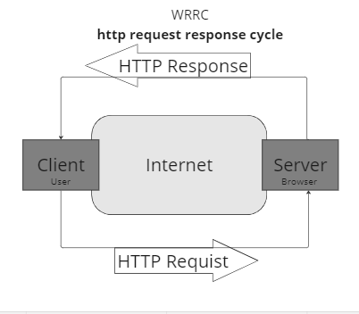

# Movies-Library

setting up the server of the movie app and create the basic structures

# Project Name - Project Version 

**Author Name**: Ayah AQ

## WRRC

- 1

- 2

- 3

## Overview

## Getting Started

- clone the repo
- install needed platform & framework such as node js and express
- write npm start on terminal
- you can use browser on thunder client to send request

## Project Features

- The app listens on port 8000.

- The app has the following routes using the GET request:

- The '/' Home page rout
- The '/favorite' route
- The app has an error handling route for status 500 and 404

- # New -1

- The '/trending' is trending movie rout
- The '/search' is the search rout to use it go to following url: 'https://api.themoviedb.org/3/search/company?api_key=${apiKey}&query=${searchQuery}' // replace apiKey with yours and searchQuery with movie name.
  - The '/genreHandler' is the genre rout to use it go to following url: 'h<https://api.themoviedb.org/3/genre/movie/list?api_key=${apiKey}&language=en-US>' // replace apiKey with yours
- The '/upComingMovieHandler' is the upComingMovie rout to use it go to following url: 'https://api.themoviedb.org/3/movie/upcoming?api_key=${apiKey}&language=en-US&page=1' // replace apiKey with yours

- # New - 2
- The '/newMovie' allows u to add the movie to the list using post
-  The '/getMovie' allows u to see the movies u have in DB list